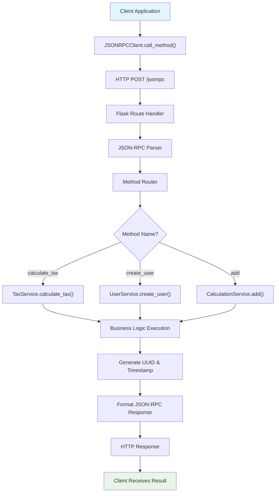
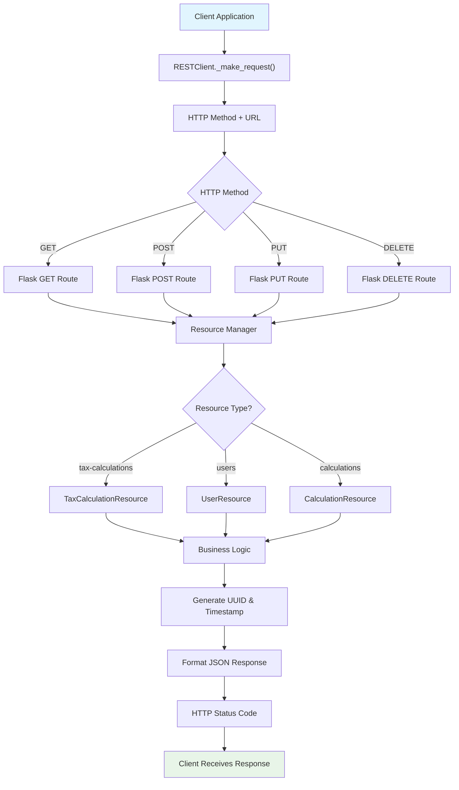
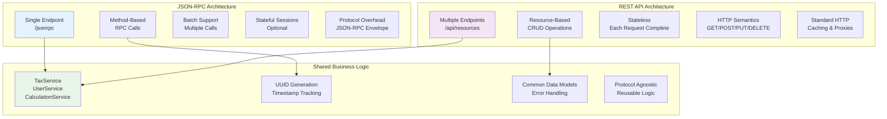
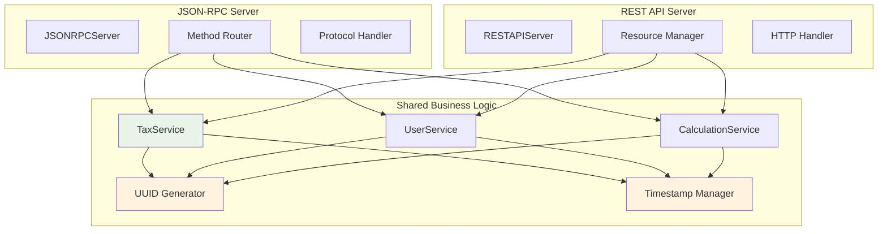
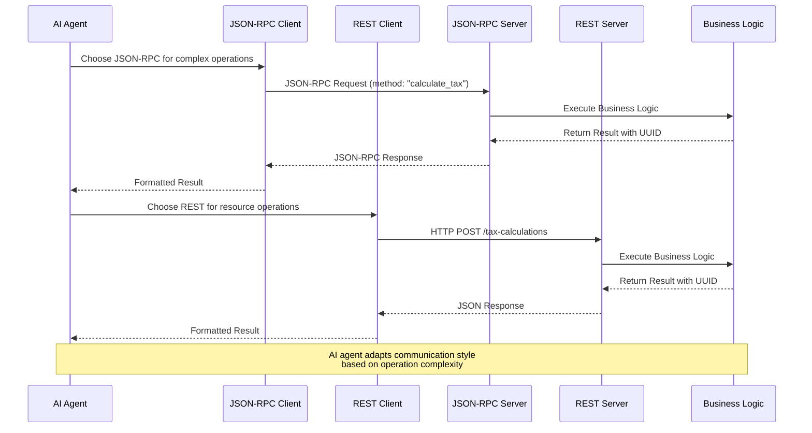

# JSON-RPC vs REST API: A Hands-On Learning Project

## Overview

This project provides a practical comparison between JSON-RPC and REST API architectures through implementation and testing. Both protocols serve different paradigms for client-server communication, each with distinct advantages and use cases.

## Protocol Comparison

### JSON-RPC (Remote Procedure Call)

**Paradigm**: Action-oriented / Procedural
**Transport**: Typically HTTP POST, but can use TCP, WebSockets, etc.
**Format**: JSON-based request/response

#### Key Characteristics:
- **Method-centric**: Focuses on calling specific procedures/functions
- **Single endpoint**: All requests go to one URL
- **Protocol statelessness**: Each request is independent (implementations can maintain state)
- **Direct function mapping**: Client calls map directly to server methods
- **Batch requests**: Can send multiple requests in a single call
- **Error handling**: Standardized error format with codes

#### JSON-RPC Request Structure:
```json
{
  "jsonrpc": "2.0",
  "method": "calculateTax",
  "params": {"income": 50000, "deductions": 5000},
  "id": 1
}
```

#### JSON-RPC Response Structure:
```json
{
  "jsonrpc": "2.0",
  "result": {"tax": 9000, "effectiveRate": 0.20},
  "id": 1
}
```

#### Best Use Cases:
- Backend microservices communication
- Blockchain node interactions (Ethereum, Bitcoin)
- Real-time applications requiring low latency
- Complex business logic operations
- Internal API communications
- **AI Agent Systems**: JSON-RPC is widely used in AI agent contexts for tool calling, function execution, and agent communication
- When you need to call specific functions remotely

#### AI Agent Usage

JSON-RPC is particularly well-suited for AI agent systems because it enables:

- **Tool Calling**: Agents can call specific functions with structured parameters
- **Function Discovery**: Agents can query available methods and their signatures
- **Batch Operations**: Multiple tool calls can be batched for efficiency
- **Error Handling**: Standardized error responses help agents handle failures gracefully

**Example AI Agent Workflow:**
```json
// Agent discovers available tools
{"jsonrpc": "2.0", "method": "listTools", "id": 1}

// Agent calls a tool to calculate tax
{"jsonrpc": "2.0", "method": "calculateTax", "params": {"income": 75000, "deductions": 10000}, "id": 2}

// Agent performs multiple operations in batch
[
  {"jsonrpc": "2.0", "method": "createUser", "params": {"name": "Agent", "email": "agent@ai.com"}, "id": 3},
  {"jsonrpc": "2.0", "method": "add", "params": {"a": 100, "b": 200}, "id": 4},
  {"jsonrpc": "2.0", "method": "get_server_info", "id": 5}
]
```

**Real-world AI Agent Examples:**
- **Model Context Protocol (MCP)**: Uses JSON-RPC for AI model to tool communication
- **LangChain Tools**: Many tools use JSON-RPC interfaces for agent interaction
- **AutoGen Agents**: Framework uses JSON-RPC for multi-agent communication
- **OpenAI Function Calling**: OpenAI's mechanism allowing AI models to call external functions/tools by describing available functions in API calls, enabling structured tool use and reducing hallucinations - similar to JSON-RPC's method calling but using OpenAI's proprietary API format

### REST API (Representational State Transfer)

**Paradigm**: Resource-oriented / Architectural style
**Transport**: HTTP/HTTPS
**Format**: Various (JSON, XML, HTML, etc.)

#### Key Characteristics:
- **Resource-centric**: Focuses on manipulating data entities
- **Multiple endpoints**: Different URLs for different resources
- **Stateless**: Each request contains all necessary information
- **HTTP methods**: Uses GET, POST, PUT, DELETE semantically
- **Cacheable**: Responses can be cached for performance
- **Uniform interface**: Consistent way to interact with resources

#### REST API Examples:
```http
GET /api/users/123           # Retrieve user
POST /api/users              # Create new user
PUT /api/users/123           # Update user
DELETE /api/users/123        # Delete user
POST /api/tax-calculations   # Create tax calculation
```

#### REST Response Example:
```json
{
  "id": 456,
  "income": 50000,
  "deductions": 5000,
  "tax": 9000,
  "effectiveRate": 0.20,
  "calculatedAt": "2025-10-03T10:30:00Z"
}
```

#### Best Use Cases:
- Web APIs for frontend applications
- Public APIs for third-party integration
- CRUD operations on resources
- Distributed systems requiring scalability
- Mobile applications
- When resources need to be cached or accessed by multiple clients

## Technical Differences

| Aspect | JSON-RPC | REST API |
|--------|----------|----------|
| **Philosophy** | Call remote functions | Manipulate resources |
| **Endpoints** | Single endpoint | Multiple resource endpoints |
| **HTTP Methods** | Primarily POST | GET, POST, PUT, DELETE, etc. |
| **Caching** | Difficult to cache | Easy to cache (especially GET) |
| **Discoverability** | Requires documentation | Self-descriptive URLs |
| **Batch Operations** | Native support | Requires custom implementation |
| **Error Handling** | Standardized error codes | HTTP status codes |
| **Statelessness** | Can be stateful | Must be stateless |
| **Versioning** | Method-level versioning | URL or header versioning |

### Statelessness Explained

**JSON-RPC**: Can maintain state between requests, allowing for session-based interactions where the server remembers client context. This enables more complex workflows but can complicate scaling and caching.

**How JSON-RPC maintains state:**
- **Session storage**: Server can store client-specific data (user preferences, authentication tokens, workflow progress)
- **Method chaining**: One method call can set up state that subsequent calls reference (e.g., `startTransaction()` followed by multiple `addItem()` calls, then `commitTransaction()`)
- **Context variables**: Server maintains variables that persist across multiple method calls within a session
- **Client identification**: Uses session IDs, tokens, or client identifiers to associate state with specific clients

**Example workflow:**
```javascript
// Client makes multiple related calls
{"jsonrpc": "2.0", "method": "login", "params": {"user": "alice"}, "id": 1}
{"jsonrpc": "2.0", "method": "setWorkingDirectory", "params": {"path": "/home/alice"}, "id": 2}
{"jsonrpc": "2.0", "method": "listFiles", "params": {}, "id": 3}  // Uses stored working directory
```

**REST API**: Must be stateless - each request contains all necessary information. No server-side session state is maintained, making it easier to scale horizontally and enabling better caching and reliability.

## Architecture Overview

This project implements both JSON-RPC and REST API architectures with clean separation of concerns and layered design patterns.

### JSON-RPC Architecture

#### 3-Layer Architecture

**1. Client Layer (`clients/jsonrpc_client.py`)**
```python
class JSONRPCClient:
    def __init__(self, server_url="http://localhost:8001/jsonrpc"):
        self.session = requests.Session()  # HTTP connection management
    
    def call_method(self, method: str, params=None) -> Any:
        # JSON-RPC protocol handling
        request = {"jsonrpc": "2.0", "method": method, "id": self._get_next_id()}
        response = self.session.post(self.server_url, json=request)
        return response.json()["result"]
    
    # High-level convenience methods
    def calculate_tax(self, income, deductions=0):
        return self.call_method("calculate_tax", {"income": income, "deductions": deductions})
```

**2. Protocol Layer (`jsonrpc_server/server.py`)**
```python
class JSONRPCServer:
    def __init__(self):
        self.app = Flask(__name__)
        # Initialize business logic services
        self.tax_service = TaxService()
        self.user_service = UserService()
        self.calculation_service = CalculationService()
    
    def _call_method(self, method: str, params):
        # Method routing to business logic
        method_map = {
            'calculate_tax': self.tax_service.calculate_tax,
            'create_user': self.user_service.create_user,
            'add': self.calculation_service.add,
        }
        func = method_map[method]
        return func(**params)
```

**3. Business Logic Layer (`jsonrpc_server/methods.py`)**
```python
class TaxService:
    def calculate_tax(self, income: float, deductions: float = 0) -> Dict[str, Any]:
        # Pure business logic - no HTTP or protocol concerns
        taxable_income = max(0, income - deductions)
        tax_amount = taxable_income * tax_rate
        return {
            "income": income,
            "tax_amount": tax_amount,
            "calculation_id": str(uuid.uuid4()),  # Unique tracking
            "calculated_at": datetime.now().isoformat()
        }

class UserService:
    def create_user(self, name: str, email: str, age: Optional[int] = None):
        # User management logic
        
class CalculationService:
    def add(self, a: float, b: float) -> Dict[str, Any]:
        # Mathematical operations
```

#### JSON-RPC Code Flow

```
Client Request → HTTP POST → Flask Route → JSON-RPC Parser → Method Router → Business Logic → JSON-RPC Response
     ↓              ↓            ↓             ↓              ↓              ↓            ↓
jsonrpc_client.py → HTTP → jsonrpc_server.py → Protocol → Routing → methods.py → Logic → JSON-RPC
```



**Key Characteristics:**
- **Single Endpoint**: All requests go to `/jsonrpc`
- **Method Dispatching**: Server routes method names to appropriate service functions
- **Protocol Agnostic**: Business logic doesn't know about HTTP/JSON-RPC details
- **Batch Support**: Multiple method calls in single HTTP request
- **Error Standardization**: Consistent error codes and messages

### REST API Architecture

#### 4-Layer Architecture

**1. Client Layer (`clients/rest_client.py`)**
```python
class RESTClient:
    def __init__(self, base_url="http://localhost:8002"):
        self.session = requests.Session()
        self.base_url = base_url
    
    def _make_request(self, method: str, endpoint: str, **kwargs) -> Dict[str, Any]:
        url = f"{self.base_url}{endpoint}"
        response = self.session.request(method, url, **kwargs)
        return response.json()
    
    # Resource-based convenience methods
    def create_tax_calculation(self, income, deductions=0):
        return self._make_request("POST", "/api/tax-calculations", 
                                json={"income": income, "deductions": deductions})
    
    def get_user(self, user_id):
        return self._make_request("GET", f"/api/users/{user_id}")
```

**2. Protocol Layer (`rest_server/server.py`)**
```python
class RESTAPIServer:
    def __init__(self):
        self.app = Flask(__name__)
        # Initialize resource managers
        self.tax_calculations = TaxCalculationResource()
        self.users = UserResource()
        self.calculations = CalculationResource()
    
    # Flask routes delegate to resource methods
    @self.app.route('/api/tax-calculations', methods=['GET', 'POST'])
    def tax_calculations_collection():
        if request.method == 'GET':
            return self._get_tax_calculations()
        elif request.method == 'POST':
            return self._create_tax_calculation()
```

**3. Resource Layer (`rest_server/resources.py`)**
```python
class TaxCalculationResource:
    def get_all_calculations(self, limit: int = 50, offset: int = 0) -> Dict[str, Any]:
        # Resource management logic
        calculations = list(self.calculations.values())
        return {
            "calculations": calculations[offset:offset+limit],
            "total": len(calculations),
            "limit": limit,
            "offset": offset
        }
    
    def create_calculation(self, income: float, deductions: float = 0, **kwargs) -> Dict[str, Any]:
        # Create new tax calculation resource
        calc_id = str(uuid.uuid4())
        calculation = {
            "id": calc_id,
            "income": income,
            "deductions": deductions,
            # ... calculation logic
        }
        self.calculations[calc_id] = calculation
        return calculation
```

**4. Business Logic Layer (Shared with JSON-RPC)**
```python
# REST API reuses the same business logic classes from jsonrpc_server/methods.py
# TaxService, UserService, CalculationService are shared between both implementations
```

#### REST API Code Flow

```
Client Request → HTTP Method → Flask Route → Resource Manager → Business Logic → JSON Response
     ↓              ↓              ↓             ↓                ↓              ↓
rest_client.py → GET/POST/PUT → rest_server.py → resources.py → methods.py → JSON → HTTP Status
```



**Key Characteristics:**
- **Multiple Endpoints**: Different URLs for different resources (`/api/users`, `/api/tax-calculations`)
- **HTTP Semantics**: Uses GET, POST, PUT, DELETE methods appropriately
- **Resource Management**: Focus on CRUD operations on data entities
- **Stateless**: Each request contains all necessary information
- **Cacheable**: GET requests can be cached by HTTP proxies/CDNs

### Shared Components

#### Business Logic Reuse
Both implementations share the same business logic classes (`TaxService`, `UserService`, `CalculationService`) from `jsonrpc_server/methods.py`, demonstrating:

- **Separation of Concerns**: Business logic is independent of communication protocol
- **Code Reusability**: Same calculation logic serves both JSON-RPC and REST APIs
- **Testing Benefits**: Business logic can be tested independently of HTTP concerns

#### Common Features
- **Unique Identifiers**: All operations generate `calculation_id` UUIDs for tracking
- **Timestamps**: `calculated_at`/`created_at`/`updated_at` fields for auditing
- **Error Handling**: Consistent error responses across both protocols
- **Type Safety**: Full type annotations throughout the codebase

### Architecture Comparison



### Shared Business Logic Flow



### Request/Response Format Comparison

```mermaid
graph TD
    subgraph "JSON-RPC Request"
        JR1["{"]
        JR2["  \"jsonrpc\": \"2.0\","]
        JR3["  \"method\": \"calculate_tax\","]
        JR4["  \"params\": {\"income\": 50000},"]
        JR5["  \"id\": 1"]
        JR6["}"]
    end
    
    subgraph "JSON-RPC Response"
        JS1["{"]
        JS2["  \"jsonrpc\": \"2.0\","]
        JS3["  \"result\": {"]
        JS4["    \"tax_owed\": 8500,"]
        JS5["    \"calculation_id\": \"uuid\","]
        JS6["    \"calculated_at\": \"timestamp\""]
        JS7["  },"]
        JS8["  \"id\": 1"]
        JS9["}"]
    end
    
    subgraph "REST API Request"
        RR1["POST /api/tax-calculations"]
        RR2["Content-Type: application/json"]
        RR3["{"]
        RR4["  \"income\": 50000,"]
        RR5["  \"deductions\": 5000"]
        RR6["}"]
    end
    
    subgraph "REST API Response"
        RS1["HTTP 201 Created"]
        RS2["Content-Type: application/json"]
        RS3["{"]
        RS4["  \"tax_owed\": 8500,"]
        RS5["  \"calculation_id\": \"uuid\","]
        RS6["  \"calculated_at\": \"timestamp\","]
        RS7["  \"_links\": {\"self\": \"/api/...\"}"]
        RS8["}"]
    end
    
    style JR1 fill:#e3f2fd
    style JS1 fill:#e3f2fd
    style RR1 fill:#f3e5f5
    style RS1 fill:#f3e5f5
```

### Architecture Benefits

#### JSON-RPC Advantages
- **Function-Oriented**: Direct method calls match programming paradigms
- **Batch Operations**: Multiple calls in single request reduce latency
- **Protocol Flexibility**: Can work over any transport (HTTP, WebSockets, TCP)
- **State Management**: Can maintain session state between calls

#### REST API Advantages
- **Resource-Oriented**: Natural mapping to data entities
- **HTTP Ecosystem**: Leverages existing web infrastructure (caching, proxies, browsers)
- **Scalability**: Stateless design enables horizontal scaling
- **Discoverability**: Self-descriptive URLs and standard HTTP methods

#### Shared Benefits
- **Clean Architecture**: Clear separation between protocol, resources, and business logic
- **Testability**: Each layer can be tested independently
- **Maintainability**: Changes to one layer don't affect others
- **Extensibility**: Easy to add new methods/resources without affecting existing code

This architecture demonstrates how the same business logic can be exposed through different API paradigms, allowing developers to choose the most appropriate protocol for their use case.

## Project Implementation Plan

### Phase 1: Project Setup
1. **Directory Structure**:
   ```
   jsonrpc_restapi/
   ├── README.md
   ├── requirements.txt
   ├── jsonrpc_server/
   │   ├── __init__.py
   │   ├── server.py
   │   └── methods.py
   ├── rest_server/
   │   ├── __init__.py
   │   ├── server.py
   │   └── resources.py
   ├── clients/
   │   ├── __init__.py
   │   ├── jsonrpc_client.py
   │   └── rest_client.py
   ├── tests/
   │   ├── test_jsonrpc.py
   │   └── test_rest.py
   └── examples/
       ├── comparison_demo.py
       └── performance_test.py
   ```

2. **Dependencies**:
   - Flask (for both servers)
   - requests (for clients)
   - json-rpc (for JSON-RPC implementation)
   - pytest (for testing)

### Phase 2: JSON-RPC Implementation
1. **Server Features**:
   - Tax calculation service
   - User management methods
   - Mathematical operations
   - Batch request handling
   - Error handling with proper codes

2. **Example Methods**:
   - `calculateTax(income, deductions)`
   - `createUser(name, email)`
   - `getUserById(userId)`
   - `performCalculation(operation, operands)`
   - `getBatchResults(requests)`

### Phase 3: REST API Implementation
1. **Resources**:
   - `/api/tax-calculations` - Tax calculation records
   - `/api/users` - User management
   - `/api/calculations` - Mathematical operations
   - `/api/health` - Health check endpoint

2. **Endpoints**:
   - GET, POST, PUT, DELETE for each resource
   - Query parameters for filtering
   - Pagination support
   - Proper HTTP status codes

### Phase 4: Client Implementations
1. **JSON-RPC Client**:
   - Method call abstraction
   - Batch request support
   - Error handling
   - Connection management

2. **REST Client**:
   - Resource-based operations
   - HTTP method abstraction
   - Response caching simulation
   - Status code handling

### Phase 5: Testing & Comparison
1. **Functional Tests**:
   - Verify both implementations work correctly
   - Test error scenarios
   - Validate response formats

2. **Performance Comparison**:
   - Latency measurements
   - Throughput testing
   - Memory usage comparison
   - Caching effectiveness

3. **Usage Demonstrations**:
   - Side-by-side comparisons
   - Real-world scenarios
   - Best practice examples

## Learning Objectives

By completing this project, you will understand:

1. **Architectural Differences**: How action-oriented vs resource-oriented paradigms affect design
2. **Implementation Patterns**: Different ways to structure server and client code
3. **Performance Characteristics**: When each approach is more efficient
4. **Error Handling**: How errors are communicated in each protocol
5. **Caching Strategies**: Why REST is more cache-friendly
6. **Scalability Considerations**: How each approach scales differently
7. **Use Case Selection**: When to choose JSON-RPC vs REST

## Getting Started

### Installation

1. **Install dependencies:**
   ```bash
   pip install -r requirements.txt
   ```

2. **Run the project:**
   ```bash
   # Start both servers
   python run.py servers
   
   # In another terminal, run the comparison demo
   python run.py demo
   
   # Run performance tests
   python run.py perf
   
   # Run unit tests
   python run.py test
   ```

### Manual Server Startup

**JSON-RPC Server:**
```bash
python -m jsonrpc_server.server
```
- Runs on http://localhost:8001
- JSON-RPC endpoint: http://localhost:8001/jsonrpc

**REST API Server:**
```bash
python -m rest_server.server
```
- Runs on http://localhost:8002
- API endpoints: http://localhost:8002/api/*

### Testing the APIs

**JSON-RPC Example:**
```bash
curl -X POST http://localhost:8001/jsonrpc \
  -H "Content-Type: application/json" \
  -d '{
    "jsonrpc": "2.0",
    "method": "calculate_tax",
    "params": {"income": 50000, "deductions": 5000},
    "id": 1
  }'
```

**AI Agent Tool Calling Example:**
```bash
# Agent discovers available tools
curl -X POST http://localhost:8001/jsonrpc \
  -H "Content-Type: application/json" \
  -d '{"jsonrpc": "2.0", "method": "get_server_info", "id": 1}'

# Agent performs tax calculation
curl -X POST http://localhost:8001/jsonrpc \
  -H "Content-Type: application/json" \
  -d '{
    "jsonrpc": "2.0",
    "method": "calculate_tax",
    "params": {"income": 75000, "deductions": 15000},
    "id": 2
  }'

# Agent performs batch operations
curl -X POST http://localhost:8001/jsonrpc \
  -H "Content-Type: application/json" \
  -d '[
    {"jsonrpc": "2.0", "method": "create_user", "params": {"name": "AI Agent", "email": "agent@ai.com"}, "id": 3},
    {"jsonrpc": "2.0", "method": "add", "params": {"a": 42, "b": 58}, "id": 4},
    {"jsonrpc": "2.0", "method": "ping", "id": 5}
  ]'
```

**REST API Example:**
```bash
curl -X POST http://localhost:8002/api/tax-calculations \
  -H "Content-Type: application/json" \
  -d '{"income": 50000, "deductions": 5000}'
```

### Running Examples

**Comparison Demo:**
```bash
python examples/comparison_demo.py
```

**AI Agent Demo:**
```bash
python examples/ai_agent_demo.py
```



**Performance Tests:**
```bash
python examples/performance_test.py
```

**Unit Tests:**
```bash
python -m pytest tests/ -v
```

## Project Structure

```
jsonrpc_restapi/
├── README.md                    # This documentation
├── requirements.txt             # Python dependencies
├── run.py                       # Convenience script for running everything
├── jsonrpc_server/             # JSON-RPC server implementation
│   ├── __init__.py
│   ├── server.py               # Flask server with JSON-RPC endpoints
│   └── methods.py              # Business logic methods
├── rest_server/                # REST API server implementation
│   ├── __init__.py
│   ├── server.py               # Flask server with REST endpoints
│   └── resources.py            # Resource classes (CRUD operations)
├── clients/                     # Client implementations
│   ├── __init__.py
│   ├── jsonrpc_client.py       # JSON-RPC client
│   └── rest_client.py          # REST API client
├── tests/                       # Unit tests
│   ├── test_jsonrpc.py         # JSON-RPC server tests
│   └── test_rest.py            # REST API server tests
└── examples/                    # Demonstration scripts
    ├── comparison_demo.py      # Side-by-side comparison
    ├── ai_agent_demo.py        # AI agent tool calling examples
    └── performance_test.py     # Performance benchmarking
```

This hands-on approach will give you practical experience with both protocols and help you make informed decisions about which to use in different scenarios.